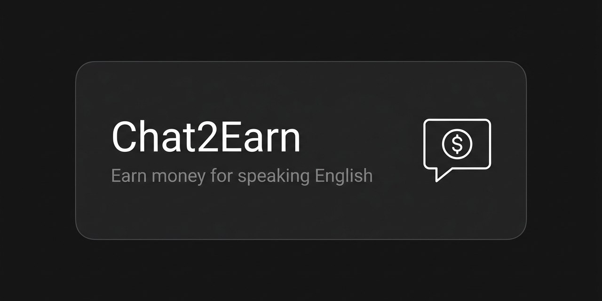

# Chat2Earn

[](LICENSE)
[]()
[]()

Pays players server money for chatting in English. Every message gets scored
by an AI model (Groq, `llama-3.1-8b-instant`), and the payout scales with
how good the English is.

<p align="center">
  
</p>

## Why this plugin exists

On a language-learning server the chat is the lesson. Money is the
motivation: if speaking English pays, students type instead of lurking. The
scoring model keeps it fair. A one-word "yes" pays nothing, and Russian-only
spam pays nothing.

## How it works

1. A player sends a chat message.
2. `LanguageDetector` checks the shape: at least 3 words, less than 49%
   Cyrillic characters. Messages that fail pay nothing.
3. `AIScorer` sends the message to Groq and gets a quality score back.
4. The score becomes points: up to 4 points per message, worth $0.10 each.
5. `EconomyManager` pays out through Vault, so any economy plugin works.
6. Every $5.00 of earnings triggers a milestone message.

The AI call runs async. Chat never waits on Groq; the reward message appears
a moment later.

## Requirements

- Paper or Spigot 1.21+
- [Vault](https://www.spigotmc.org/resources/vault.34315/) + an economy plugin (e.g. [EssentialsX](https://essentialsx.net/downloads.html))
- A Groq API key from https://console.groq.com (free tier works)

## Install

1. Download `Chat2Earn.jar` from [Releases](https://github.com/itsfedor/chat2earn/releases/latest) (or use the copy in the repo root).
2. Put the jar in `plugins/`.
3. Copy `config.example.yml` to `config.yml` in the same folder.
4. Put your Groq key in `config.yml`.
5. Restart the server.

## Configuration

```yaml
groq:
  api-key: "YOUR_...KEY"
  model: "llama-3.1-8b-instant"
  timeout-seconds: 10

scoring:
  points-per-message-max: 4
  dollars-per-point: 0.10
  milestone-dollars: 5.0

filters:
  min-words: 3
  max-cyrillic-percent: 49
```

Tuning notes:

- `max-cyrillic-percent: 49` is the anti-spam line. Students who mix
  languages mid-sentence (common at A1) will sometimes score below it.
  Raise it to 60 if your group mixes a lot.
- `points-per-message-max: 4` at $0.10 per point caps a message at $0.40.
- If scores feel off, swap the model for a stronger one. The instant model
  is cheap and fast, which matters when the whole chat is being scored.

## Troubleshooting

- **Nobody gets paid** — check the console for Vault errors: an economy plugin must be installed and registered (Vault alone is not enough).
- **Invalid API key in the log** — the Groq key in `config.yml` must be the full key from console.groq.com; the placeholder `YOUR_...KEY` pays nothing and logs warnings.
- **Messages in English still pay $0** — that's the filter working: fewer than 3 words, or more than 49% Cyrillic, pays nothing by design.

## Pair it with

[EnglishProgression](https://github.com/itsfedor/englishprogression), which
watches lifetime earnings and promotes players up a LuckPerms track at set
thresholds. The two were designed as a pair.

## Build

```bash
./gradlew build
```

Requires JDK 21. Produces `build/libs/Chat2Earn.jar`.

The jar in this repo is the exact build running on the ESL English Server.

## License

MIT. See [LICENSE](LICENSE).
